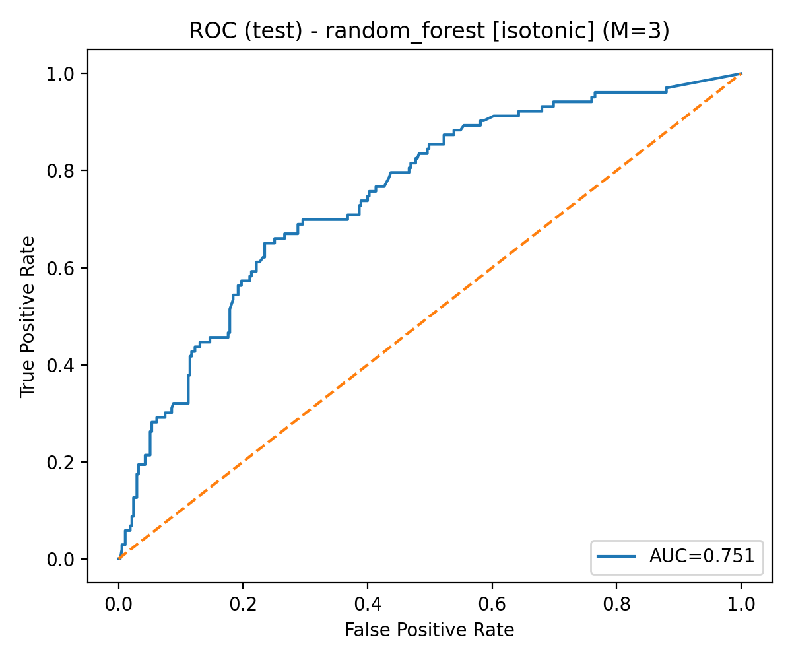
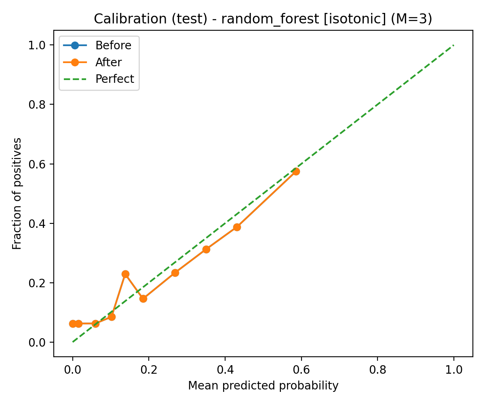
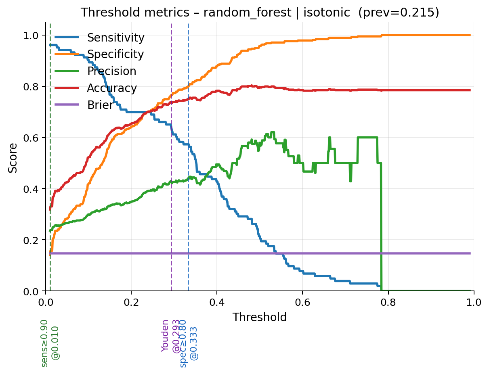
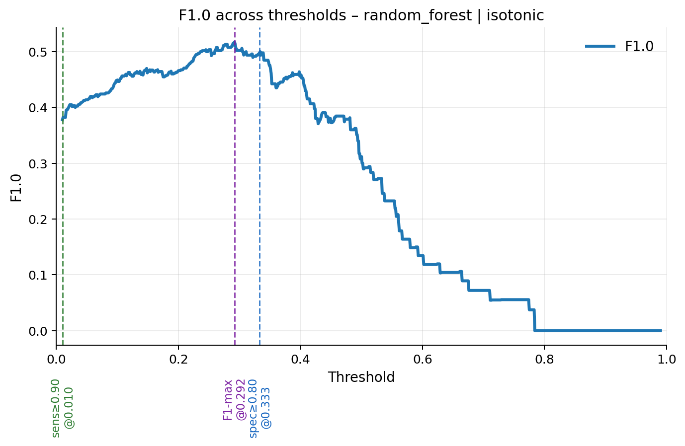
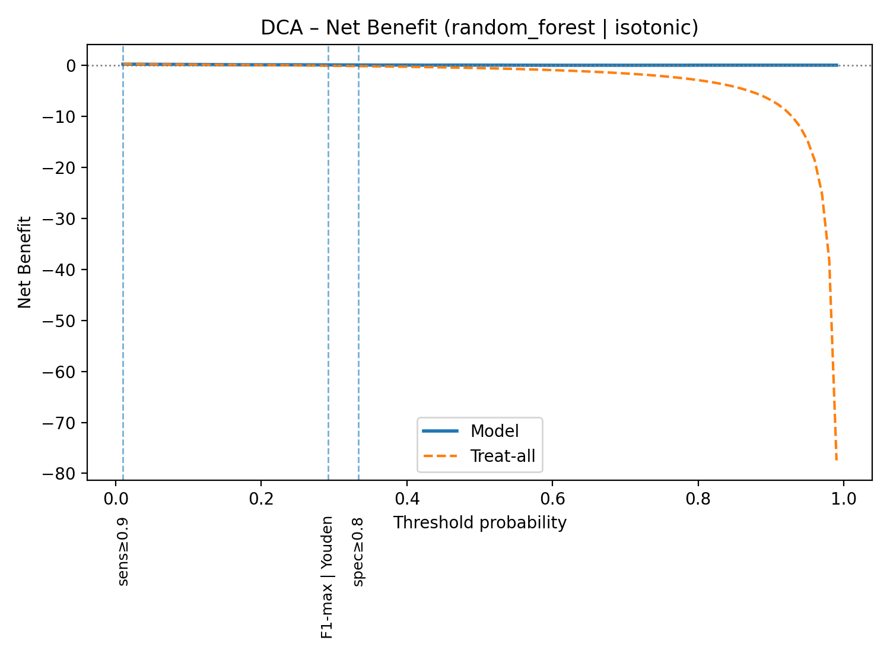
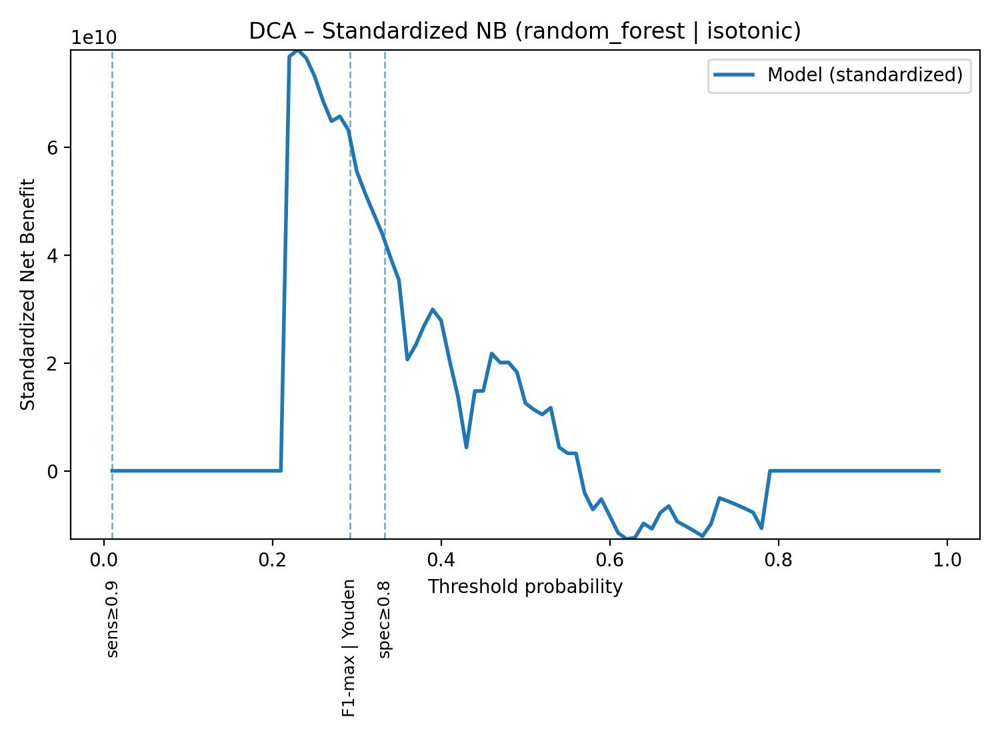
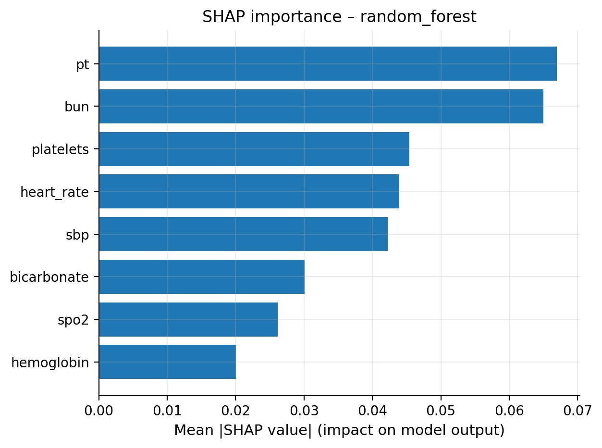
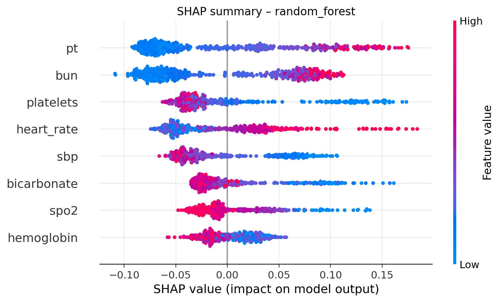

# ICU Lymphoma ML Reproduction 🧬🤖

> ⚠️ 本项目致力于 **严谨复现** 论文  
> 《使用机器学习模型预测 ICU 淋巴瘤患者的院内死亡率》  
> 通过完整的数据预处理、多重插补、模型训练、超参优化、可解释性分析与报告导出，  
> 以透明可复现的方式再现原文结果。  
> 
> 我们只是普通的研究者，谨以此项目抛砖引玉 🙏  

---

## 🚀 功能亮点

- **自动化流程**：从原始数据到最终结果，一条命令即可复现
- **多重插补 (MICE)**：支持 `m=20` 多重插补，配合 Rubin 规则整合结果
- **模型训练 & 超参搜索**：支持 `RandomForest`, `LightGBM`, `XGBoost`, `CatBoost` 等
- **阈值扫描 & 亚组分析**：复现临床场景下的决策阈值选择与分层人群评估
- **可解释性分析**：SHAP 蜂群图、变量重要性条形图、瀑布图，全方位展示模型逻辑
- **报告导出**：自动生成汇总报告与表格，助力论文写作
- **一键环境复现**：`conda.yml` + `requirements.txt` + `conda-linux-64.txt`，保证跨设备一致性

---


> 基于公开补充数据，对 ICU 淋巴瘤患者院内死亡率进行机器学习复现研究
> *We humbly hope this scaffold is helpful; any critique is sincerely welcome.* 🙇‍♂️

  

---

## 🧭 项目宗旨

我们尽力把论文复现流程**工程化、可追溯、可复跑**：

* 数据→插补→特征选择→建模→校准→评估→阈值扫描→DCA→亚组→解释→报告
* 每一步都**可单独运行**、**有中间工件**、**有图表与表格产出**
* 默认**仅需 CPU**（在曙光超算 CPU 节点亦可运行）
* 我们不自称“完美”，恳请各位老师指正 🙏

---

## ⚡ 一键起步 Quickstart

> 建议先阅读 `conf/config.yaml`，确认 `outcome_col`、特征列、以及 MI/MODEL 设置等。

```bash
# 0) 环境（可选）
make setup
make kernel

# 1) 数据摄取与预处理
make ingest
make preprocess

# 2) 多重插补（建议 M≥5；复现实验时可用 M=20）
make mi M=3

# 3) 特征选择（LASSO + 1-SE 规则 + 高相关裁剪）→ 8个特征
make feature-select

# 4) 训练与评估（支持 raw / isotonic / sigmoid）
make train MODEL=random_forest METHOD=isotonic KFOLDS=5
make evaluate MODEL=random_forest METHOD=isotonic N_BOOT=1000 PLOT_CI=1

# 5) 阈值扫描与 DCA
make threshold-scan MODEL=random_forest METHOD=isotonic SENS_TARGETS=0.9 SPEC_TARGETS=0.8
make dca MODEL=random_forest METHOD=isotonic

# 6) 亚组评估与 SHAP 解释
make subgroup MODEL=random_forest METHOD=isotonic
make shap    MODEL=random_forest

# 7) 报告导出（汇总产出清单）
make report MODEL=random_forest METHOD=isotonic
```

**更多一键流程**

* 对 15 个模型的快速横向对比（训练→校准→评估）：

  ```bash
  make compare-all METHOD=isotonic KFOLDS=5 N_BOOT=1000
  ```
* 逐 m 训练与 Rubin/均值聚合（贴合 MI 学术口径）：

  ```bash
  make mi-train MODEL=random_forest METHOD=isotonic KFOLDS=5
  ```

---

## 🗂️ 目录结构

> 你可运行 `make readme-tree DEPTH=4` 将目录树注入下方占位区。

<!-- BEGIN:PROJECT_TREE -->
<!-- BEGIN:PROJECT_TREE -->
```text
.
├── catboost_info
│   ├── learn
│   │   └── events.out.tfevents
│   ├── tmp
│   ├── catboost_training.json
│   ├── learn_error.tsv
│   └── time_left.tsv
├── conf
│   └── config.yaml
├── data_processed
│   ├── columns_overview.csv
│   ├── features_processed.parquet
│   ├── missingness_overview.csv
│   └── s1_data.parquet
├── data_raw
│   ├── _reference
│   └── data.xlsx
├── env
│   ├── conda-linux-64.txt
│   ├── conda.yml
│   └── requirements.txt
├──  notebooks
│   ├── 01_data_overview.ipynb
│   ├── 02_preprocessing.ipynb
│   ├── 03_modeling.ipynb
│   └── 04_results_visualization.ipynb
├── outputs
│   ├── artifacts
│   │   ├── feature_schema.json
│   │   ├── selected_features.json
│   │   └── split_idx.joblib
│   ├── feature_selection
│   │   ├── corr_selected.png
│   │   ├── selected_features.csv
│   │   └── selected_features.json
│   ├── figures
│   │   ├── nested_cv_auc_random_forest.png
│   │   └── subgroup_forest_random_forest_isotonic.png
│   ├── logs
│   ├── mi_runs
│   │   ├── index.json
│   │   ├── mi_m01.joblib
│   │   ├── mi_m02.joblib
│   │   └── mi_m03.joblib
│   ├── models
│   │   ├── random_forest_ensemble.json
│   │   ├── random_forest_isotonic_ensemble.json
│   │   ├── random_forest_isotonic_m01.joblib
│   │   ├── random_forest_isotonic_m02.joblib
│   │   ├── random_forest_isotonic_m03.joblib
│   │   ├── random_forest_m01.joblib
│   │   ├── random_forest_m02.joblib
│   │   └── random_forest_m03.joblib
│   ├── nested_cv
│   │   ├── nested_cv_random_forest.csv
│   │   └── nested_cv_random_forest_summary.json
│   ├── shap
│   │   ├── random_forest_model.joblib
│   │   ├── shap_importance_bar_random_forest.png
│   │   ├── shap_importance_random_forest.csv
│   │   ├── shap_summary_random_forest.png
│   │   └── shap_waterfall_random_forest_idx316.png
│   ├── tables
│   │   ├── summary_metrics_random_forest.csv
│   │   └── summary_shap_top20_random_forest.csv
│   ├── best_params_lightgbm.json
│   ├── best_params_random_forest.json
│   ├── calibration_random_forest_isotonic_m01.png
│   ├── calibration_random_forest_isotonic_m02.png
│   ├── calibration_random_forest_isotonic_m03.png
│   ├── calibration_random_forest_isotonic.png
│   ├── calibration_test.png
│   ├── calibration_test_random_forest_isotonic.png
│   ├── calibration_test_random_forest.png
│   ├── dca_nb_random_forest_isotonic.png
│   ├── dca_nb_random_forest.png
│   ├── dca_random_forest.csv
│   ├── dca_random_forest_isotonic.csv
│   ├── dca_snb_random_forest_isotonic.png
│   ├── dca_snb_random_forest.png
│   ├── metrics_test.csv
│   ├── metrics_test_random_forest_ci.csv
│   ├── metrics_test_random_forest.csv
│   ├── metrics_test_random_forest_isotonic.csv
│   ├── mi_runs_random_forest.csv
│   ├── mi_summary_random_forest.json
│   ├── model_auc_test.csv
│   ├── pr_test_random_forest.png
│   ├── roc_test.png
│   ├── roc_test_random_forest_isotonic.png
│   ├── roc_test_random_forest.png
│   ├── subgroup_metrics_random_forest_isotonic.csv
│   ├── summary_report.md
│   ├── summary_shap_top20_random_forest.csv
│   ├── threshold_scan_random_forest_isotonic.csv
│   ├── threshold_scan_random_forest_isotonic_summary.json
│   ├── thresholds_random_forest.csv
│   ├── thr_fscore_random_forest_isotonic.png
│   └── thr_metrics_random_forest_isotonic.png
├── src
│   ├── __pycache__
│   │   ├── calibrate.cpython-310.pyc
│   │   ├── data_utils.cpython-310.pyc
│   │   ├── dca_copy.cpython-310.pyc
│   │   ├── dca.cpython-310.pyc
│   │   ├── evaluate.cpython-310.pyc
│   │   ├── feature_select.cpython-310.pyc
│   │   ├── ingest.cpython-310.pyc
│   │   ├── __init__.cpython-310.pyc
│   │   ├── models.cpython-310.pyc
│   │   ├── multiple_imputation.cpython-310.pyc
│   │   ├── nested_cv.cpython-310.pyc
│   │   ├── optuna_search.cpython-310.pyc
│   │   ├── preprocess.cpython-310.pyc
│   │   ├── report_export.cpython-310.pyc
│   │   ├── shap_run.cpython-310.pyc
│   │   ├── subgroup_eval.cpython-310.pyc
│   │   ├── threshold_scan.cpython-310.pyc
│   │   └── train.cpython-310.pyc
│   ├── calibrate.py
│   ├── data_utils.py
│   ├── dca_1.py
│   ├── dca_2.py
│   ├── dca.py
│   ├── evaluate.py
│   ├── feature_select.py
│   ├── feature_select_无正则化.py
│   ├── ingest.py
│   ├── __init__.py
│   ├── models.py
│   ├── multiple_imputation.py
│   ├── nested_cv.py
│   ├── optuna_search.py
│   ├── preprocess.py
│   ├── report_export.py
│   ├── shap_run.py
│   ├── subgroup_eval.py
│   ├── subgroup_eval未进行静音.py
│   ├── threshold_scan.py
│   ├── train copy.py
│   ├── train_mi.py
│   └── train.py
├── tools
│   └── update_tree.py
├── Makefile
├── project_tree.txt
└── README.md

22 directories, 125 files
```
<!-- END:PROJECT_TREE -->

---

## 🧰 环境与运行平台

* **编译器**：VS Code（支持 Jupyter Notebook 与 Python 文件）
* **平台**：曙光超算中心（示例配置：8 核 / 29GB 内存 / 无 GPU）
* **Python**：3.10；**PyTorch**：2.2.0（本项目不强依赖 GPU）
* `env/conda.yml` / `env/requirements.txt` 将在“第三阶段”统一精简与锁定版本。

---

## ⚙️ 配置文件说明（`conf/config.yaml`）

* `project.*`：随机种子、并行 `n_jobs`、缓存目录等
* `data.*`：原始数据格式与路径（支持 `excel/csv/parquet/sql`）
* `cohort.*`：纳排标准开关（例如 `adult_only`、`stay_lt_24h` 等）
* `features.*`：连续/分类/合并症等原始特征名
* `missing_data.*`：MICE 参数（估计器、迭代次数、M 次数）
* `split.*`：固定分层 7:3 训练/测试划分
* `preprocess.*`：缩放器选择、分位截尾等
* `imbalance.*`：`class_weight` 或目标阳性权重
* `selection.lasso.*`：是否启用与 CV 折数
* `models.*`：对比模型清单与 Optuna 搜索
* `evaluation.*`：指标与校准设置
* `explainability.shap.*`：SHAP 输出控制
* `output.*`：图表与表格输出目录

---

## 🧪 流水线与脚本（逐个说明）

> 我们在每个脚本里尽量都提供了**心跳提示**与 **tqdm 进度条**，减少等待焦虑 😌

### 1) `src/ingest.py` 📥

* 读取原始数据，统一 ID/结局命名，执行**固定分层** 70/30 划分并写出索引；
* 产出：`outputs/artifacts/split_idx.joblib`、列概览等。

### 2) `src/preprocess.py` 🧽

* 统一 `outcome_col` 二值化、连续特征分位截尾、分类特征独热；
* 产出：`data_processed/features_processed.parquet`、缺失概览 CSV、特征 schema JSON。

### 3) `src/multiple_imputation.py` 🧩

* **MICE 多重插补**，默认 M=3（复现论文可设 M=20）；
* 支持 `random_forest` / `bayesian_ridge` 估计器；
* 产出：`outputs/mi_runs/mi_mXX.joblib` + `index.json`（含特征顺序）。

### 4) `src/feature_select.py` 🎯

* LASSO（`LogisticRegressionCV`）+ **1-SE 规则**，自动在性能最优与稀疏之间折中；
* **相关性裁剪**（阈值默认 0.90）+ 高共线簇内仅保留其一；
* 可指定 `target_k=8`，贴近论文；
* 产出：`outputs/artifacts/selected_features.json`、频次 CSV、相关热力图。

### 5) `src/models.py` 🏗️

* 统一的**模型工厂**（15 款）：`logistic/ridge/lda/svm/knn/gaussian_nb/decision_tree/random_forest/extra_trees/gbdt/xgboost/lightgbm/catboost/adaboost/mlp`
* 全部**CPU 友好**，`class_weight` 优雅降级。

### 6) `src/optuna_search.py` 🎛️

* 对目标模型执行高效超参搜索（默认 `n_trials=30`）；
* 产出：最佳参数 JSON + 评估曲线（可选）。

### 7) `src/train.py` 🏃

* 读取 M 次插补 → **对测试集概率做平均**（MI 集成）；
* 支持 `raw/isotonic/sigmoid` 三种校准方式；
* 产出：指标 CSV、ROC/Calibration 图、模型文件等。

### 8) `src/train_mi.py` 🧮

* **逐 m 训练** + **Rubin 风格合并** + **均值集成**（贴近学术口径）；
* 产出：每 m 的指标与模型、合并表、ROC/Calibration 图。

### 9) `src/evaluate.py` 📊

* MI 概率**集成评估**；
* **Bootstrap CI**（默认 1000 次）给出 AUC / AP 的 95% CI，可选绘制 ROC/PR 的阴影置信带；
* 产出：主指标 CSV、CI CSV、ROC/PR/Calibration 图、阈值扫表。

### 10) `src/calibrate.py` 📏

* K 折校准（`isotonic/sigmoid`）；
* 写出**校准后**模型（逐 m），供 `evaluate / dca / threshold_scan / subgroup` 使用。

### 11) `src/threshold_scan.py` 🧵

* **阈值网格扫描**（可设目标敏感度/特异度，Youden、F1 自动推荐）；
* 图中竖线注释自动避让、下方垂直标签，防重叠；
* 产出：扫描表、摘要 JSON、两张曲线图（指标 & F-score）。

### 12) `src/dca.py` 🩹

* **Decision Curve Analysis**（Net Benefit 与 Standardized NB）；
* 参照线：Treat All / Treat None；
* 产出：DCA 表、两张曲线（NB/sNB）。

### 13) `src/subgroup_eval.py` 🧩

* 亚组评估（性别/年龄段/合并症等可自定义）；
* **单类亚组自动置 NaN**（不再抛出 AUC 单类警告）；
* 阈值可沿用阈值扫描推荐值；
* 产出：亚组表、森林图。

### 14) `src/shap_run.py` 🔍

* 选择 AUC 最好的 m 做 **SHAP** 解释；
* 与**所选 8 特征严格对齐**；
* 产出：SHAP 重要度 CSV、bar/swarm 图（以及可选 waterfall）。

### 15) `src/report_export.py` 🧾

* 汇总关键产出路径（指标/图表/特征等），便于复核与撰写报告。

### 16) `src/nested_cv.py` 🧪

* **嵌套交叉验证**（外层评估、内层调参）；
* 产出：每折 AUC/AP 表、折间方差、曲线与 JSON 汇总。

### 17) `src/data_utils.py` 🧰

* 通用工具箱（稳健写盘/心跳/计时/指标/Matplotlib 样式/CSV 追加去重等）。
* 后续我们将**把分散在各脚本的通用函数陆续迁入**此模块以减少重复（目前不影响使用）。

---

## 📈 示例结果展示（来自 `outputs/`）

> 下方示例截图路径与你的实验产物一致；若文件尚未生成，图片会为空白。

* **ROC 曲线（随机森林 + Isotonic）**
  

* **校准曲线（测试集）**
  

* **阈值扫描（推荐阈值与指标）**
  
  

* **DCA 曲线（NB / sNB）**
  
  

* **SHAP 重要度**
  
  

---

## 🧪 指标口径与解释（谨慎、诚实）

* 主指标：`ROC-AUC`、`Average Precision (AP)`、`Brier`、`F1/Precision/Recall/Accuracy`。
* `evaluate.py` 默认 **MI 概率平均** 后再评估，并给出 `AUC/AP` 的 **bootstrap 95% CI**。
* 概率校准选项（`raw/isotonic/sigmoid`）会**显著影响**阈值型指标（F1/Recall/Precision）；
  我们建议在**校准后**再进行**阈值扫描**与 **DCA**。

---

## 🧪 复现一致性自检

* 样本量 ≈ 1591；院内死亡率 ≈ 21.5%（见 `ingest.py` 的首轮统计）。
* 特征选择目标维度默认 **8**（可调），与原文口径接近。
* 重要提醒：不同数据清洗与特征工程细节可能导致与原文**略有差异**；我们在脚本内用注释与日志尽量透明说明原因与取舍。若您发现不合理处，诚挚欢迎指出 🙏。

---

## 💡 性能与稳定性建议

* **CPU 并行**：`conf/config.yaml` 中 `project.n_jobs=-1` 会用满可用核；如资源紧张可改小。
* **大规模 MI**：`M≥20` 会提高稳定性，但时间↑。可先 `M=3~5` 验证流程，再扩大。
* **缓存与稳健写盘**：所有 CSV/PNG/Joblib 均采用**原子写入**与**去重合并**，避免半成品。
* **日志**：长耗时环节都带**心跳**输出；若需更频繁提示，可在命令中加 `HEARTBEAT=2.0`。

---

## 🧯 常见问题（FAQ）

* **Q1：AUC/AP 的 CI 为什么有时很宽？**
  A：测试集样本量、阳性率和分布会影响 CI 宽度；bootstrap 次数 `N_BOOT` 可增大到 2000/5000。
* **Q2：亚组里 AUC 显示 NaN 是正常的吗？**
  A：当某亚组**只有单一类别**（全阳性或全阴性）时，AUC 不可定义；脚本会**自动置 NaN** 以避免误解。
* **Q3：为什么模型之间差异小？**
  A：在当前特征空间与样本规模下，树模型与线性模型可能性能接近，这是合理现象。可尝试：更细特征工程、非线性变量变换、或更丰富的临床变量。

---

## 🧑‍🏫 Notebook（第三阶段完善）

* `notebooks/01_data_overview.ipynb`：变量分布、缺失热力图、表 1 统计导出
* `notebooks/02_preprocessing.ipynb`：清洗细节核验
* `notebooks/03_modeling.ipynb`：模型对比与消融实验
* `notebooks/04_results_visualization.ipynb`：论文图版式统一（字号/线宽/配色）

---

## 🔐 数据合规与伦理

* 使用的是去标识化补充数据（S1 Data）；仅用于科研与方法复现；
* 若要扩展至真实临床场景，请务必遵循当地法律法规与伦理审批流程。

---

## 🤝 致谢与引用

我们非常感谢原论文作者的公开数据与方法启发；若本脚手架在您的研究中提供了帮助，也欢迎在文末作为工具引用（可简单写作 “ICU Lymphoma ML Reproduction Scaffold (version 20250909)”）。

---

## 🏷️ 版权与归属（重要）

**本脚手架归 *嘉宁科技* 所有。**
© 2025 Jianing Technology Co., Ltd. 保留所有权利。
如需用于教学/科研/内部试验之外的用途，敬请先与我们联系。我们非常乐意在合理与合规的前提下共同推进工作。🙏

---

## 📮 联系我们

* Issues / PR：欢迎在代码层面提出任何建议，我们会**非常认真**地学习与改进。
* 也可通过邮件/内部渠道与我们沟通（）。

> *Again, we are grateful for any feedback. Thank you for your time and patience.* 🌟

---

## 📝 致谢与展望

本项目只是对原论文的**一次复现尝试**，难免有不足之处。
若您在使用中发现任何问题或改进空间，欢迎提出 issue 或 PR 🙌

**感谢所有帮助我完成复现工作的同仁与前辈**，也感谢开源社区的力量。
希望本项目能为临床机器学习的 reproducibility 尽一份绵薄之力。

—— *谨以此项目，献给每一位 ICU 中的淋巴瘤患者与关心他们的医护人员。*

---
